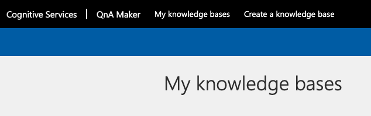
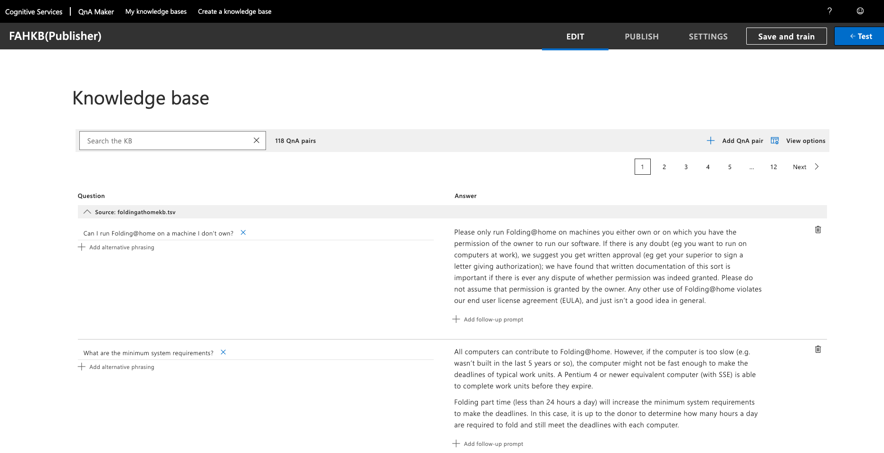
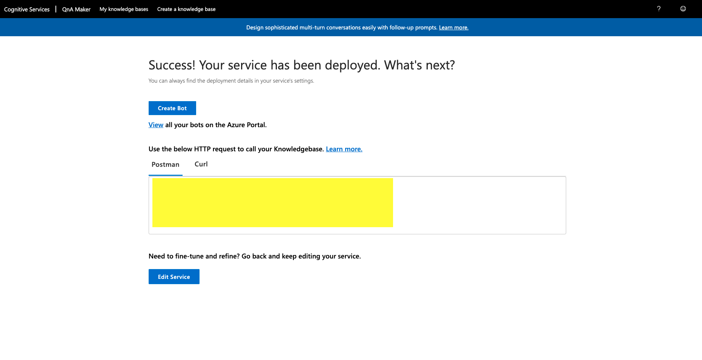

# FOLDING@HOME Team 999 - Microsoft fight on COVID-19

This is a solution to create a Folding@Home Chat bot to help answer FAQ Questions about Folding@Home project.

The bot is created based on the Azure Conversational AI Technologies including QNAMaker and Azure Bot Services.

[Please use this application URL to access Chat Bot](https://fahfrontend.azurewebsites.net)


## Why did I create this bot?
I wanted to contribute to the effort of folding@home project, and helping other contributors to learn more about this project by providing a chat bot which can quickly finding the Folding@Home related FAQs. Also, I would like shared the knowledge about how did I created this chat bot. 

## How did I created this chatbot

1. Go to https://www.qnamaker.ai/
2. On the top right corner of QNAMaker page, click "Sign in". If you do not have an Azure account yet, it will route you to the signup page. You should get $200 free Azure Credit if you are first time user.
3. Once you logged in, click on 'Create a knowledge base' on the top of the page. 



4. Fill out the Step 1 to Step 3 in the 'Create a knowledge base' page. 

5.  In STEP 4 'Populate your KB', under 'File Name', add the folding@homekb.tsv file from this repository.

6. In STEP 4 'Chit-Chat' section, choose any style you like. 

7. Click on Create your KB button. Then your KB is created as this image.




8. You can then edit exiting Question and Answer pairs or add new pairs following [this Microsoft Doc](https://docs.microsoft.com/en-us/azure/cognitive-services/qnamaker/quickstarts/add-question-metadata-portal).

9. Once you finished editing, you can click on 'Publish' on the top right of corner of your knowledge base page. Then in the next page click 'Publish' button again.



10. Copy the detail information inside the Postman Box and paste into Notebook or OneNote. The information is needed for the follow steps.

11. Then, you can use FAHChatBot sample bot in this repository to create your own bot based on the knowledge base you have just created. 

12. Open the FAHChatBot in Visual Studio, and open the *appsetting.json* file, update your knowledge base information in follow section of the *appsetting.json* file.

```
  "QnAKnowledgebaseId": "",
  "QnAAuthKey": "",
  "QnAEndpointHostName": ""
```

12. You can run your project locally, and test the bot in bot emulator [(install bot emulator)](https://github.com/Microsoft/BotFramework-Emulator/blob/master/README.md)

13. (optional) Then you can choose to deploy your bot to azure. [Here is the instruction on how to deploy](https://docs.microsoft.com/en-us/azure/bot-service/bot-builder-deploy-az-cli?view=azure-bot-service-4.0&tabs=csharp).
