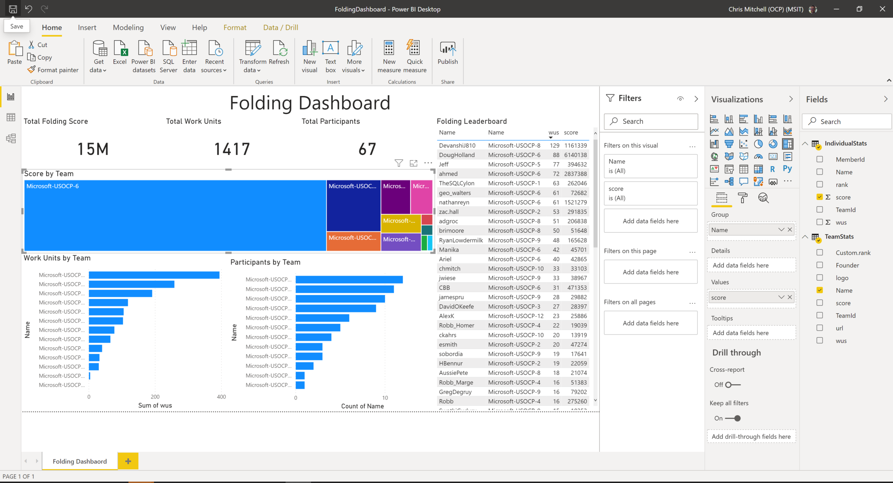

# FOLDING@HOME OCP Dashboard

In order to track folding activities by team, there is a Power BI report that exercises the folding.org APIs.  This dashboard shows the following information:
1. Folding Score by Team
1. Work Units by Team
1. Participants by Team
1. Units and Score by User Name.

In addition clicking on any bar in the chart will filter the list down to just the participants with that team.

## Using the dashboard

Use the following stesps to consume the dashbard on your local machine:
1. Download the pbix file from [/dashboards/FoldingDashboard.pbix](./FoldingDashboard.pbix)
2. Open the file in Power BI desktop
3. Click "Refresh" on the ribbon to get the lastest data

Note:  Power BI Desktop only works on windows, but we'll be publishing this dashboard to Power BI so you can consume it via a browser.