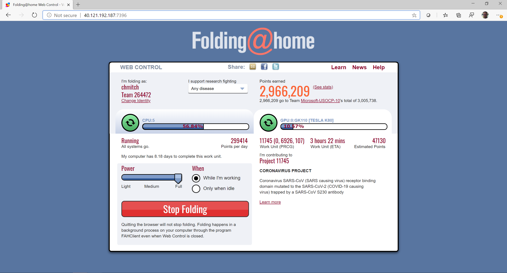
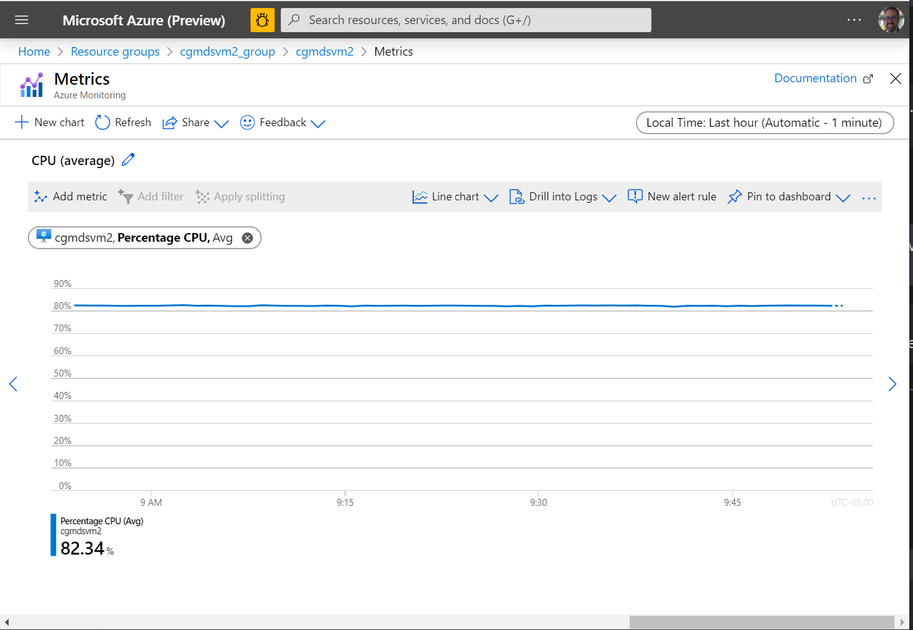
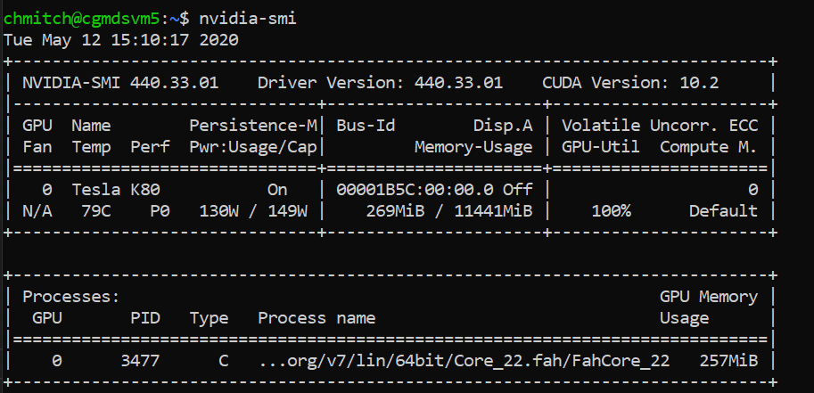

# Prerequisites

Deploying FAH on an Azure virtual machine is easy. Rather you are a Windows, MacOs or Linux user, all you really need is to [install Azure CLI](https://docs.microsoft.com/en-us/cli/azure/install-azure-cli?view=azure-cli-latest). Azure CLI should be running version 2.6.0 or later. Use ```az --version``` to check your current installed version.

The GPU VM is an Ubuntu Server 18.04 based image and will be deployed as an Azure "Standard_NC6_Promo" VM.  This VM class is a great value for GPU Enabled VMS and will enable GPU Folding on Azure. 

# Deploying the Azure GPU VM

In order to deploy the GPU VM, you will need to log in to Azure using AZ CLI, point to the subscription you want to deploy to and optionally create an Azure Resource Group.

* Login to Azure using the ```az login``` command.

* After successfully login, set the default subscription using the ```az account set -s "Your subscription id"```.<br> you can easily retrieve the subscription id using the ```az account list -o table``` command. 

* Every Azure VM needs to be deploy in a Resource Group so go ahead and deploy one: <br>   
```az group create -l "The Azure region" -n "Name of the RG"``` <br>   
Example: ```az group create -l eastus -n GPU-Folding-COVID19```


* Now that you have a new RG created, you can go ahead and deploy the GPU VM in a single command: <br>

```az deployment group create --name "folding" --resource-group "GPU-Folding-COVID19" --template-uri https://raw.githubusercontent.com/likamrat/foldingathome/master/deploy/azure/azuredeploy_gpu.json --parameters https://raw.githubusercontent.com/likamrat/foldingathome/master/deploy/azure/azuredeploy_gpu.parameters.json```

**Note: Don't forget to match the resource group name based on the one you created**

# Advanced VM Deployment

The ARM Template leverages a parameters file with preconfigured values for things like username and password.   While you can clone this repo and make the necessary modifications to the files to override the defaults, there is a quicker path leveraging the same ```--parameters``` cli argument.  For example, the following command would do the same deployment with a customized username and password:

```az deployment group create --name "folding" --resource-group "Folding-COVID19" --template-uri https://raw.githubusercontent.com/likamrat/foldingathome/master/deploy/azure/azuredeploy_gpu.json --parameters adminUsername="<some username>" adminPasswordOrKey="<some strong password>" ```

**Note:  You'll need to replace ```<some username>``` and ```<some strong password>``` with your own values.**


# How to use it?

The VM is now deployed and you can use it. Get the public IP of the VM, paste it in your browser and add the "7396" port to it. 


You can see here that your VM is using both CPUs and a GPU to fold.



If you examine the performance you can now see that you're using a little over 80% of your avaialbe CPU.  This equates to 5 of the 6 CPUs are being used for folding.  The 6th CPU is actually being used to drive the GPU activity.



From the shell on the machine running the ```nvidia-smi``` command will show statistics about the GPU, and indicate that the GPU is being 100% utilized.



# Reboot & Shutdown

Don't worry about rebooting the VM, the FAM client will start automatically on boot. 

To stop folding just click "Stop Folding" or shutdown/delete the VM. 
