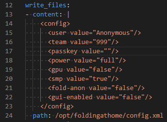
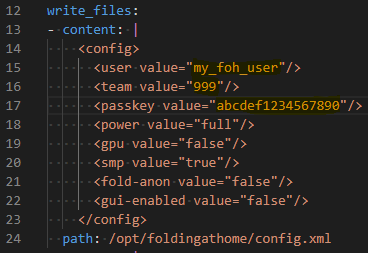
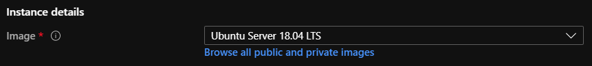

# Prerequisites

Cloud subscription in Azure. (AWS and GCP instructions coming soon!)

# Optional tracking configuration

Create a Folding @ Home passkey [here](https://apps.foldingathome.org/getpasskey)
Find the team you'd like to support; by default, the compute will occur under the Anonymous user for the Microsoft (#999) team

Modify the following foh-cloud-init.yaml elements with your details: user, team, passkey




NOTE: Whitespace is important in .yaml files, be sure to only modify the highlighted characters between the double quotes!

# Using Azure Portal

Create a VM or VM Scale Set utilizing the Ubuntu 18.04 LTS image, set up with all required fields and any other desired modifications.



Copy and paste the entirity of the [foh-cloud-init.yaml](../deploy/cloud-init/foh-cloud-init.yaml) into the Custom data field.


# Using Azure CLI

In order to deploy the VM, you will need to log in to Azure using AZ CLI, point to the subscription you want to deploy to and optionally create an Azure Resource Group.

* Login to Azure using the ```az login``` command.

* After successfully login, set the default subscription using the ```az account set -s "Your subscription id"```.<br> you can easily retrieve the subscription id using the ```az account list -o table``` command. 

* Every Azure VM needs to be deploy in a Resource Group so go ahead and deploy one: <br>   
```az group create -l "The Azure region" -n "Name of the RG"``` <br>
Example: ```az group create -l eastus -n Folding-COVID19```

* After creation of the resource group, you can deploy either a single VM, or a VM scale set using the ```--custom-data``` tag

* For a single F2 VM:
```az vm create --name "folding" --resource-group "Folding-COVID19" --image Canonical:UbuntuServer:18.04-LTS:latest --custom-data foh-cloud-init.yaml --size Standard_F2 --generate-ssh-keys```

* For a VM Scale Set of two F2 instances:
```az vmss create --name "folding" --resource-group "Folding-COVID19" --image Canonical:UbuntuServer:18.04-LTS:latest --custom-data foh-cloud-init.yaml --vm-sku Standard_F2 --generate-ssh-keys```

Go to the documents on [UbuntuServer](docs/UbuntuServer.md) and [Azure](docs/Azure.md) for more information.

# Using Google Compute Engine Portal

* Under VM Instances, choose Create Instance

* Under Boot Disk, change Operating System to Ubuntu and Version to Ubuntu 18.04 LTS


* Expand Management, security, disks, networking, sole tenancy

* In Metadata, add Key value ```user-data``` and copy the entirity of the cloud-init script to Value

