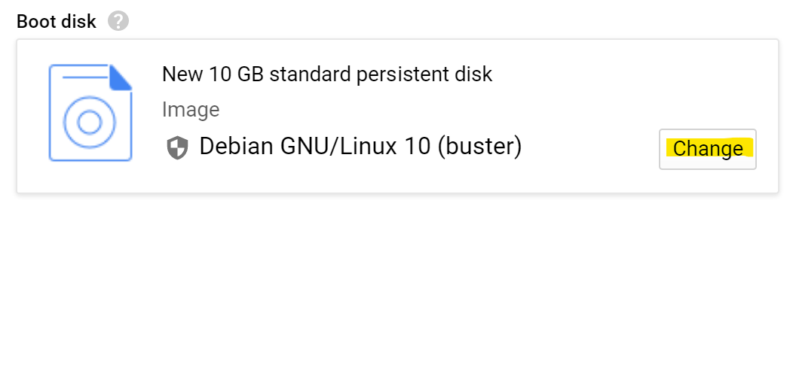
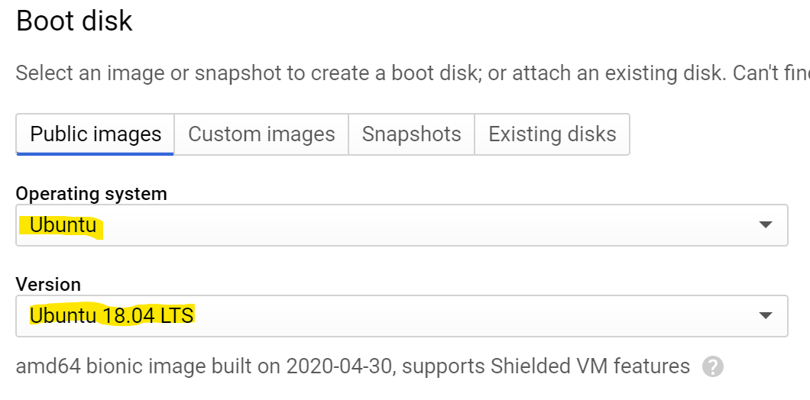
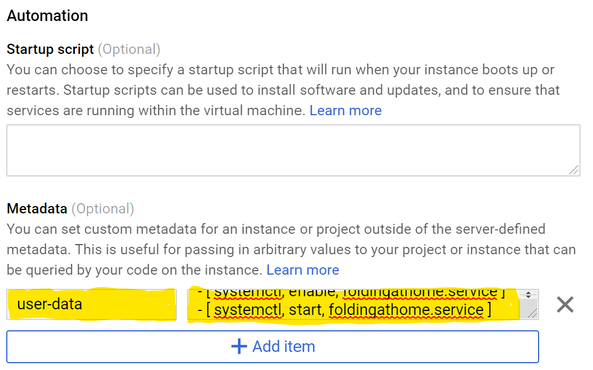
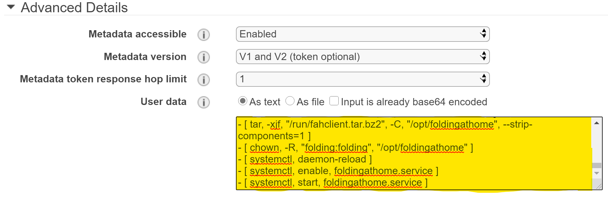

# Prerequisites

Cloud subscription in <a href="#Azure">Azure</a>, <a href="#GCP">GCP</a>, or <a href="#AWS">AWS</a>.

# Optional tracking configuration

Create a Folding @ Home passkey [here](https://apps.foldingathome.org/getpasskey)
Find the team you'd like to support; by default, the compute will occur under the Anonymous user for the Microsoft (#999) team

Download [foh-cloud-init.yaml](../deploy/cloud-init/foh-cloud-init.yaml) and modify the following  elements with your details: user, team, passkey


**NOTE**: Whitespace is important in .yaml files, be sure to only modify the highlighted characters between the double quotes!

# Using Azure Portal

1. Create a VM or VM Scale Set utilizing the Ubuntu 18.04 LTS image, set up with all required fields and any other desired modifications.<div></div>

1. Copy and paste the entirety of the [foh-cloud-init.yaml](../deploy/cloud-init/foh-cloud-init.yaml) into the Custom data field.<div></div>

<h1 id="Azure">Using Azure CLI</h1>

In order to deploy the VM, you will need to log in to Azure using AZ CLI, point to the subscription you want to deploy to and optionally create an Azure Resource Group.

1. Login to Azure using the ```az login``` command.

1. After successful login, set the default subscription using the ```az account set -s "Your subscription id"```.<br />*Hint:* You can easily retrieve the subscription id using the ```az account list -o table``` command. 

1. Download [foh-cloud-init.yaml](../deploy/cloud-init/foh-cloud-init.yaml) to your current directory.

1. Every Azure VM needs to be deploy in a Resource Group so go ahead and deploy one:<br />
```az group create -l "The Azure region" -n "Name of the RG"```<br />
Example: ```az group create -l eastus -n Folding-COVID19```</div>

1. After creation of the resource group, you can deploy either a single VM, or a VM scale set using the ```--custom-data``` tag

1. For a single F2 VM:
```az vm create --name "folding" --resource-group "Folding-COVID19" --image Canonical:UbuntuServer:18.04-LTS:latest --custom-data foh-cloud-init.yaml --size Standard_F2 --generate-ssh-keys```

1. For a VM Scale Set of two F2 instances:
```az vmss create --name "folding" --resource-group "Folding-COVID19" --image Canonical:UbuntuServer:18.04-LTS:latest --custom-data foh-cloud-init.yaml --vm-sku Standard_F2 --generate-ssh-keys```

Go to the documents on [UbuntuServer](docs/UbuntuServer.md) and [Azure](docs/Azure.md) for more information.

# Using Google Compute Engine Portal
<span id="GCP"></span>

1. Under *VM Instances*, choose *Create Instance*

1. Under *Boot Disk*, change *Operating System* to ```Ubuntu``` and *Version* to ```Ubuntu 18.04 LTS```<div><br /></div>

1. Expand *Management, security, disks, networking, sole tenancy*

1. Under *Automation/Metadata*, add *Key* value ```user-data``` and copy the entirety of [foh-cloud-init.yaml](../deploy/cloud-init/foh-cloud-init.yaml) to *Value*<div></div>

# Using AWS Portal
<span id="AWS"></span>

1. Create EC2 Instance with Ubuntu 18.04.

2. Under *Step 3: Configure Instance Details*, copy entirety of [foh-cloud-init.yaml](../deploy/cloud-init/foh-cloud-init.yaml) into *Advanced Details/User Data*<div></div>