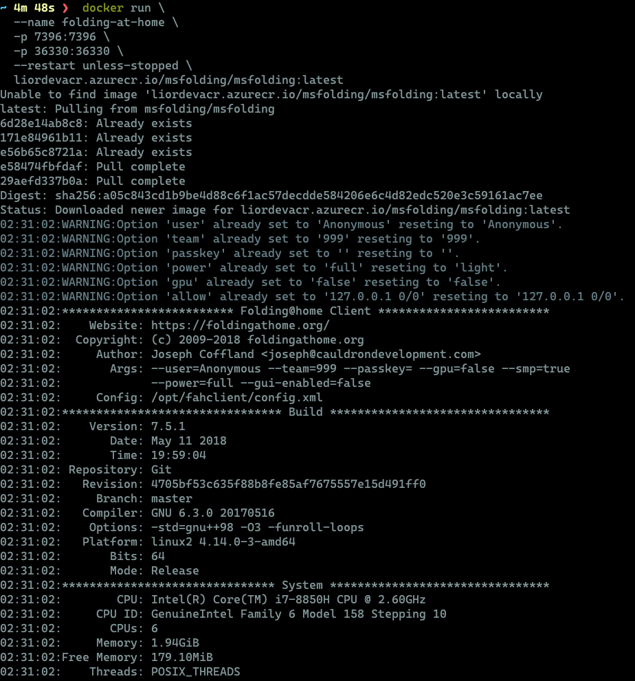
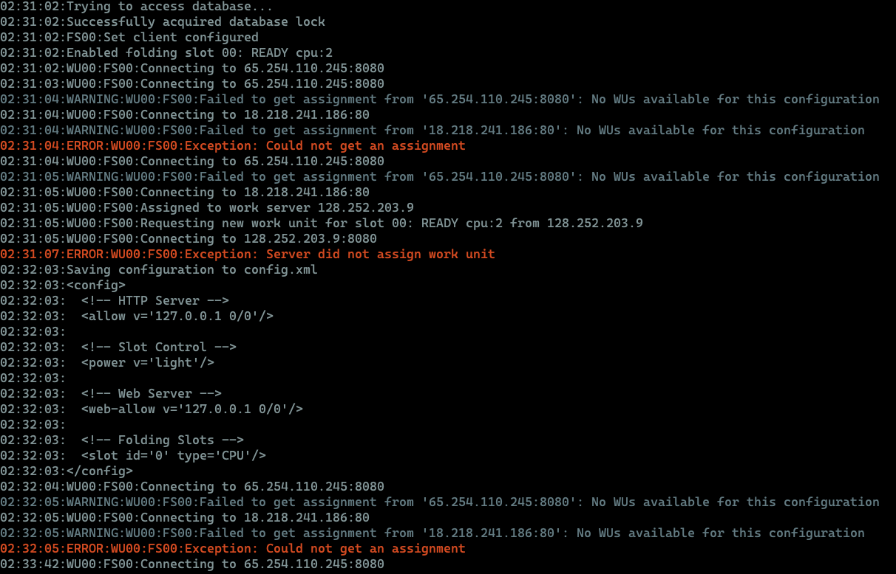
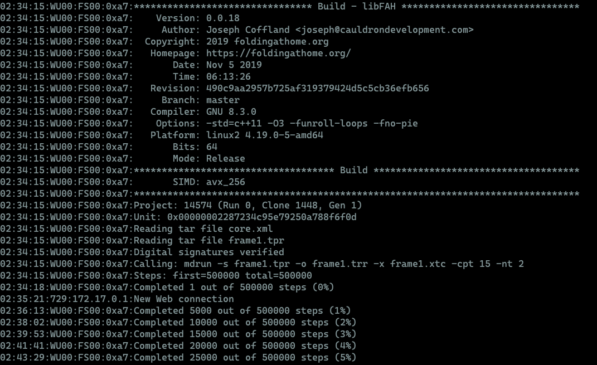
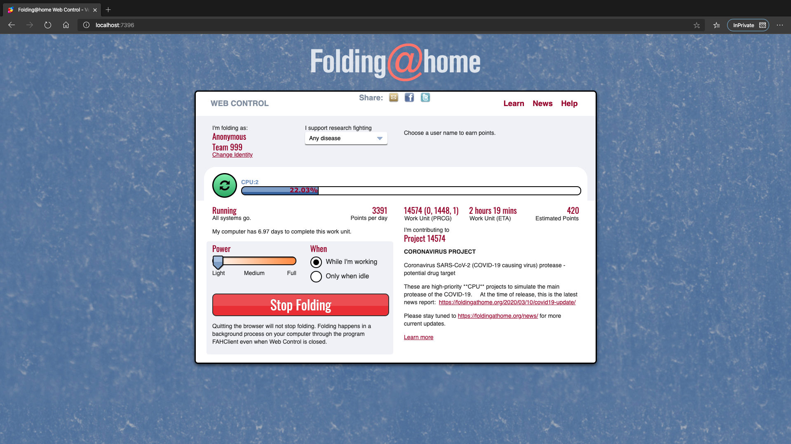

# Prerequisites

Although this seems to be a more "advanced" way of deploy FAH, it's really not!
The entire point is to deploy an isolated environment without having anything installed locally. 

* Well, you will need to [download & install Docker](https://www.docker.com/products/docker-desktop) on your machine (dahhhh :smile:)

* The Docker image is stored in an [Azure Container Registry (ACR)](https://azure.microsoft.com/en-us/services/container-registry/#security) with no Anonymous access enabled. Prior to running the container, log in to the mentioned ACR:

```docker login -u pulltoken -p 4A=jBw69CoMNqLq2Lqrb2YVapQWPC19e liordevacr.azurecr.io```

# Running to container

To run the container, simply run below command in your terminal:

```docker run --name folding-at-home -p 7396:7396 -p 36330:36330 --restart unless-stopped -d liordevacr.azurecr.io/msfolding/msfolding:latest```

This will run the docker image as a deamon process, without showing any log output. 

To view the logs, either [download and use the Docker Desktop application](https://www.docker.com/products/docker-desktop), or run the following command (using `CTRL+C` to quit following the logs):

```docker logs --follow folding-at-home```

Alternatively, to view the log output, run the following command to output the logs to the same window (noting you cannot ever close this window without killing the image):

```docker run --name folding-at-home -p 7396:7396 -p 36330:36330 --restart unless-stopped liordevacr.azurecr.io/msfolding/msfolding:latest```

This how various stages of the logs should look like:







## Why am I seeing "Could not get an assignment" errors?

As you can see, at the beginning of the container run, the following errors will appear: 

"***ERROR:WU00:FS00:Exception: Could not get an assignment***"  
"***ERROR:WU00:FS00:Exception: Server did not assign work unit***"

Do not worry about this! It simply means you still haven't been assigned with a server to with FOLDING@HOME. 

# It's alive!

By default, the container is to configure to expose port 7396 and will allow you to access *http://localhost:7396* from your browser. 



Now you can see that everything up and running and you are folding on behalf of Microsoft (team 999). 

# How do I control this thing?

Yes, this container is a CPU hogger, so controlling it is crtical! 

Your options include:
1. Open the web control at *http://localhost:7396* and use the available controls (can you see the giant "Stop Folding" button?). You can also configure other settings here. 
2. Stop/start: `docker stop folding-at-home` and `docker start folding-at-home` 
3. Use the Docker Desktop application to stop/start (there is no pause option in the UI)
4. Pause/unpause: `docker pause folding-at-home` and `docker unpause folding-at-home`

In theory, the pause method will be quicker to continue processing from where it left off, but does cause a clock skew in the folding - so use it only for 'short' pauses, otherwise just use the stop/start method.

# How do I get rid of this thing?

To kill and delete the running instance of the image, run the following command:

```docker rm -f folding-at-home```

***Optional***: To remove the Docker image from your machine, run the following command:

```docker rmi liordevacr.azurecr.io/msfolding/msfolding:latest```
