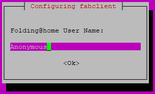
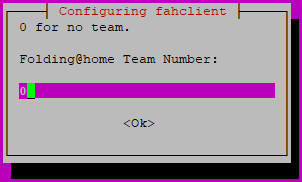
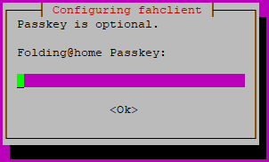
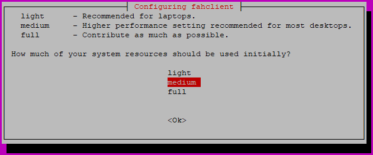
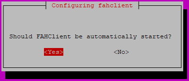
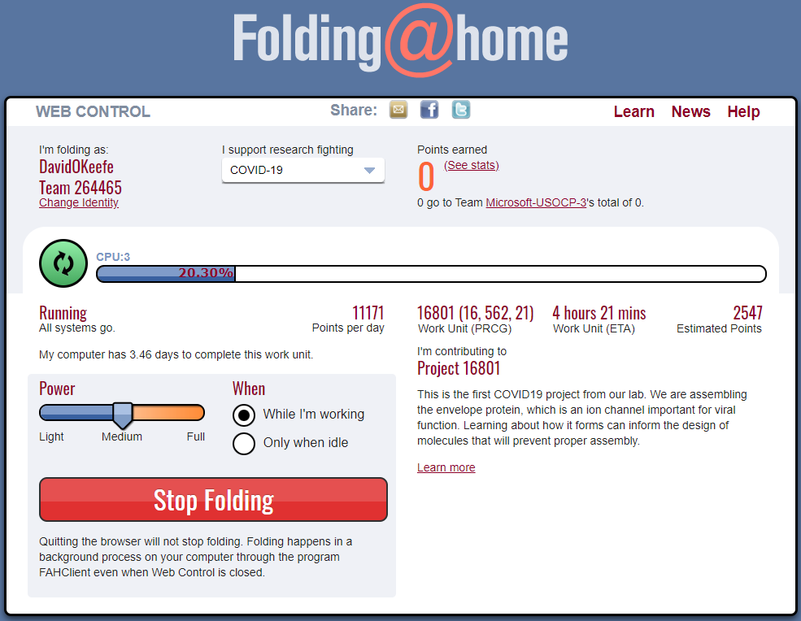
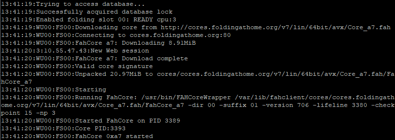
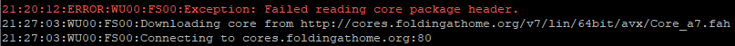

# Prerequisites

Download the latest Folding at Home client for Ubuntu listed [here](https://foldingathome.org/alternative-downloads/).

```wget https://download.foldingathome.org/releases/public/release/fahclient/debian-stable-64bit/v7.6/fahclient_7.6.9_amd64.deb```

# Installation

Install the FAHClient

```sudo dpkg -i --force-depends fahclient_7.6.9_amd64.deb```

Enter the name to be displayed on the public leaderboard.



Enter the team code provided by your manager or 999 to join the Microsoft team.



Optionally enter a passkey.



Enter the amount of system resources to consume. This value can be changed at a later date.



Configure the FAHClient to start automatically.



# Remotely Access Web Client

By default, the web configuration client is not available remotely.  To view the status and change the configuration of the FAHClient, it is necessary to configure remote access.

To stop the FAHClient prior to editing the config, run the following command.

```sudo /etc/init.d/FAHClient stop```

Add the following to the end of the configuration located at ```/etc/fahclient/config.xml```, replacing x.x.x.x with the IP address of the computer which should be granted remote access.  To allow remote access everywhere, replace x.x.x.x with 0/0.  To allow remote access to a subnet, specify the address using CIDR notation (ie 192.168.0/24).

```
<!-- Grant Remote Access -->
<allow>127.0.0.1 x.x.x.x</allow>
<web-allow>127.0.0.1 x.x.x.x</web-allow>
```

***Tip***: If you are unfamiliar with editing files in Linux via CLI, you can use the following commands.

```sudo vi /etc/fahclient/config.xml```<br />
Type ```i``` to enter insert mode.  Make any necessary changes.<br />
Press ```Esc``` to exit insert mode.<br />
Type ```:wq``` to save and exit.

To start the FAHClient when finished editing the config, run the following command.

```sudo /etc/init.d/FAHClient stop```

***Note***: When editing the config.xml file for the first time, the file may be modified by the FAHClient before you can save your changes.  If this happens, close and reopen the config.xml file before adding and saving your changes.

# Remotely Access Web Client

Open a web browser and navigate to http://y.y.y.y:7396/ where y.y.y.y is the address of your Ubuntu Server.



# Reviewing Log Files

Review the FAHClient log file to ensure there are no errors and you downloaded work files.

```sudo cat /var/lib/fahclient/log.txt```



***Note***: If your Ubuntu server is behind a Sophos UTM firewall, you may see the following error in the log file. To correct this error, add a Transparent Mode Skiplist exception in Web Protection for your Ubuntu server.


